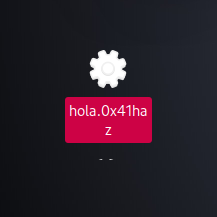
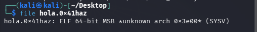
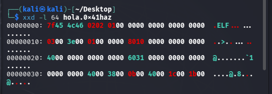
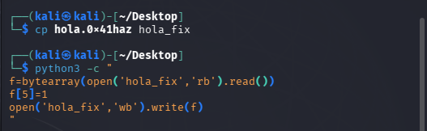
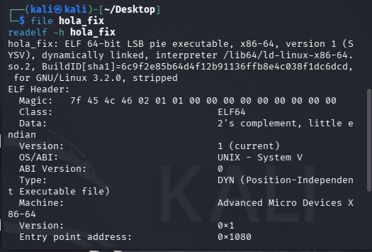
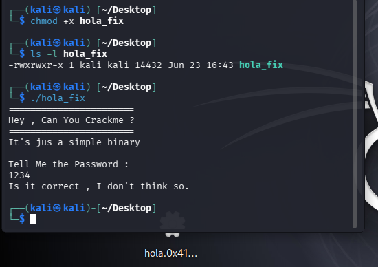
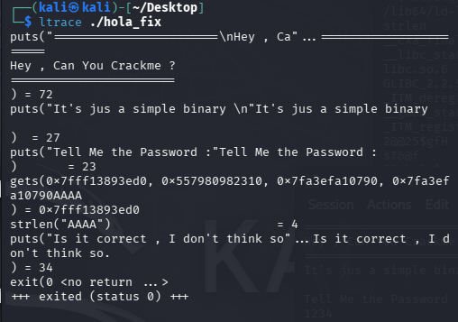
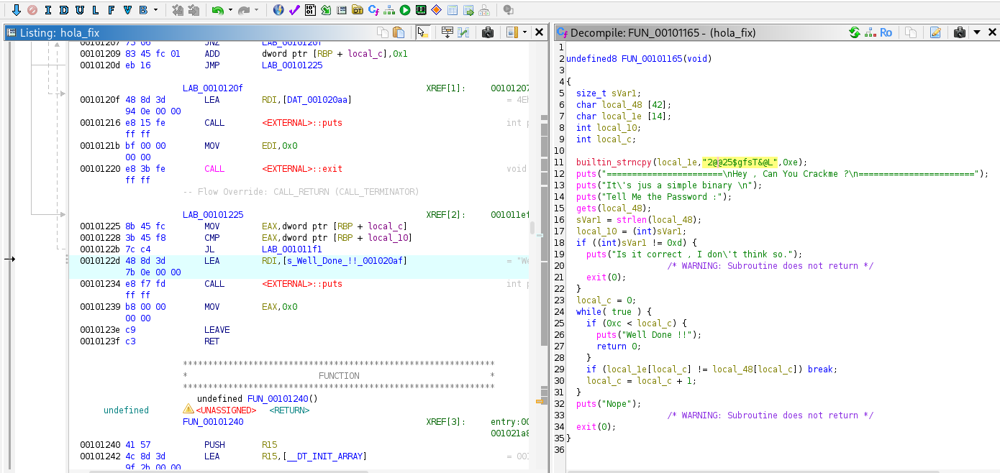
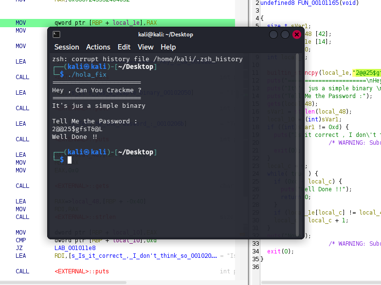

# ctf-reversing-0x41haz por: THEODORE RINEHART

# 🧠 CTF Reversing - 0x41haz Crackme

## 📌 Descripción
Hoy vamos a realizar ingenieria inversa, vamos a analizar un binario ELF de 64 bits con técnicas básicas de reversing para encontrar la contraseña, este archivo no es ningún hash, mas bien es una contraseña hardcodeada para ser dificil de encontrar.

Para esto se utlizó Kali Linux en una VM, herramientas pre-instaladas en kali e instalamos GHydra.

📁 Puedes descargar el archivo que originalmente se llama "0x41haz-1640335532346.0x41haz". Yo personalmente le cambie el nombre a "hola.0x41haz" para más facilidad.


---

## 🔍 1. Identificación del binario
Se usa el comando:

```bash
file hola.0x41haz
```


Notamos algo raro en resultado: 
"ELF 64-bit MSB *unknown arch 0x3e00* (SYSV)"

Normalmente un ELF de x86-64 se ve así:
"ELF 64-bit LSB executable, x86-64"

Vemos que en lugar de decir LSB(Little Endian) dice MSB(Big Endian) ademas de lo sospechoso del "unknown arch 0x3e00"

## 🧰 2. Analizamos los primeros bytes del archivo

```bash
xxd -l 64 hola.0x41haz
```


En el byte que nos vamos a enfocar es en el 6xto byte, 7f 45 4c 46 02 -->02<-- 01 00
Normalmente en ELF significa:
01= LSB
02= MSB

Y dado que nos resultó sospechoso que al identificar el binario nos arrojara "MSB" vamos a prestarle atención a ese byte en el siguente paso.

## 🧠 3. Modificamos los bytes del archivo

Para confirmar nuestras sospsechas de que el archivo fue modificado a proposito, cambiaremos nosotros mismos los bytes del archivo para cambiarlo a LSB

Vamos a crear una copia del archivo que se llamará "hola.0x41haz":
```bash
xxd -l 64 hola.0x41haz
```
y después, con python, cambiaremos el byte 6 de 01 a 02:
```bash
python3 -c"
f=bytearray(open('hola_fix','rb').read())
f[5]=1
open('hola_fix', 'wb').write(f)
```


## 🔍 4. Comprobamos
Analizamos la copia "hola_fix"
```bash
readelf -h hola_fix
```


Efectivamente, como podemos observar, ya tenemos nuestro archivo listo para, ahora si, ejecutarlo, analizarlo e ir por la contraseña.

## ⚙️ 5. Pruebas



Ejecutamos el programa, e intruducimos cualquier contraseña, solo para ver como se comporta el programa.

Probamos con:
```bash
ltrace ./hola_fix
```


Nos pide que regresemos un valor "AAAA", lo regresamos.

## 💻 6. Ingenieria Inversa con Ghydra

Analizamos con Ghydra, buscamos strings, y encontramos "Well_Done_!!" , lo seleccionamos y lo descompilamos.



Al descompilarlo, podemos ver literalmente, la contraseña que estamos buscando 

builtin_strncpy(local_le,"2@@25$gfsT&@L",0xe);

----> "2@@25$gfsT&@L"


Si esa contraseña la introducimos cuando ejecutamos el programa, en efecto, nos devuelve un "Well_Done!!"


